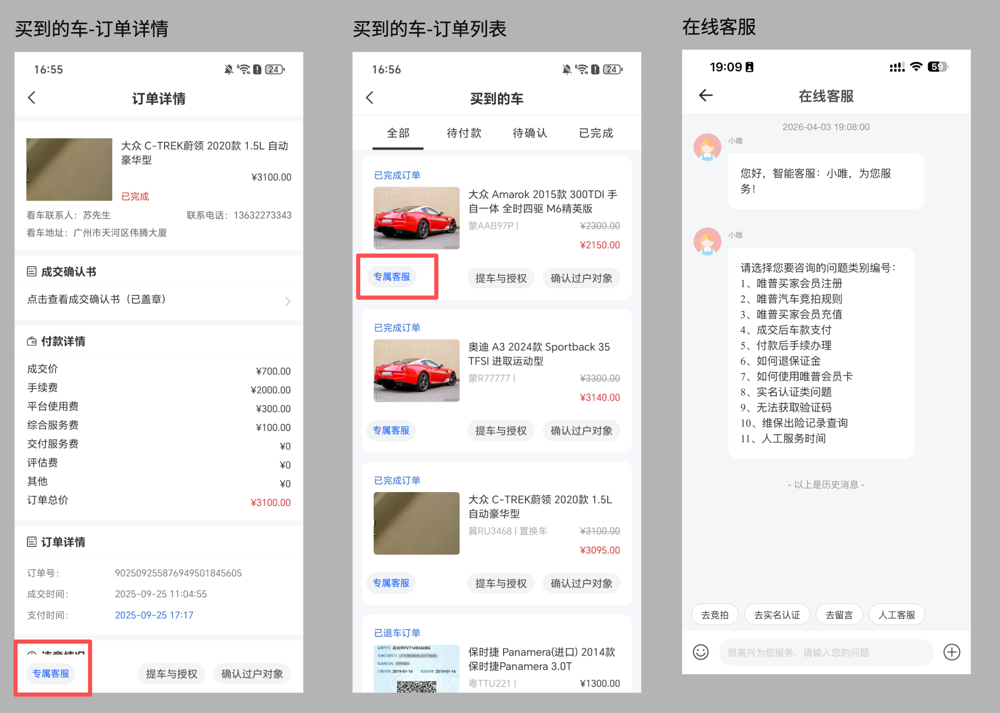
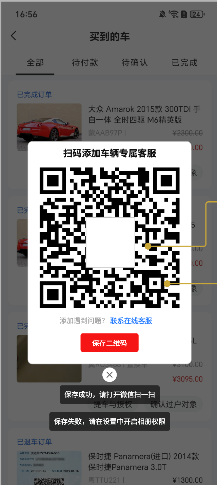

# 买到的车

## 订单列表 / 订单详情 - 专属客服按钮

### 1. 新增【专属客服】按钮

- 点击按钮，弹窗展示指定客服企微码

### 2. 按钮展示逻辑

- **2.1** 从该车辆**竞拍成功付款后**，在**过户完成前**，该按钮一直存在
- **2.2** 若该车辆发起售后，在**售后（所有售后类型）完成前**，该按钮一直存在

### 3. 按钮交互

- **3.1 功能上线后**：若**已配置**客服企微码，点击后弹窗展示该二维码
- **3.2 功能上线后**：若**未配置**客服企微码，点击后跳转【在线客服】页
- **3.3 历史数据**：点击后跳转【在线客服】页

原型图：

---

# 二维码展示

## 基础交互

1. **识别二维码**：微信小程序端，支持用户**长按**二维码调起微信原生菜单（识别 / 保存 / 转发）
2. **保存二维码**：点击按钮可保存二维码到相册；如未获取相册权限，则调起**系统相册权限申请弹窗**（采用系统默认方式即可）
3. **加载状态**：在图片资源加载完成前，弹窗中间需显示 **Loading 转圈动画**
4. **关闭**：点击"关闭"按钮，或点击灰色区域，可关闭二维码弹窗
5. **联系客服**：点击【联系客服】打开客服插件

## 二维码展示逻辑

根据当前**服务器时间**判断今日属性，从而决定读取哪份客服配置。

### 1. 判定是否为"工作日"

- 若今日日期被系统判定为**工作日**，读取当前车辆订单所属的**归属门店 ID**，在【过户服务】配置列表中，查找该门店绑定的**跟单客服**，展示该客服配置的**企微码**

### 2. 判定是否为"法定节假日"

- 若今日日期被系统判定为**法定节假日**，读取"节假日过户客服"配置：
  - **2.1** 若该车辆订单"**有过户费**"，则读取"有过户费接待客服的企微码"
  - **2.2** 若该车辆订单"**无过户费**"，则读取"无过户费接待客服的企微码"

### 3. 跟单客服分配和二维码展示逻辑

- **3.1** 系统获取该订单归属门店在后台【过户服务】中当前生效的"**跟单客服**"配置名单
- **3.2** 若该门店配置了**多名客服**，随机从中抽取一名客服；抽取完成后，将该客服与该订单**绑定**
  - 逻辑要求：**一旦绑定成功**，该订单前台的二维码展示将**固定**为此人
- **3.3** 订单一旦在"**付款后**"完成了跟单客服的绑定，即**生成数据快照**；后续对该门店的跟单客服进行了任何修改（如：新增人员、删除现有人员、清空配置等），或对节假日客服进行了修改，**仅对修改操作之后**新产生的付款订单生效
- **3.4** 已经完成分配的**历史订单**，其绑定的跟单客服保持原样，**不受后续后台配置变动的影响**

> 可参考节假日 API：https://holiday.cyi.me/api/holidays?year=2026

> **补充说明**：节假日客服仅承担"临时流量接待"的前端职能，**不改变**订单的实际业务归属。真正负责该订单过户的是**门店跟单客服**。

