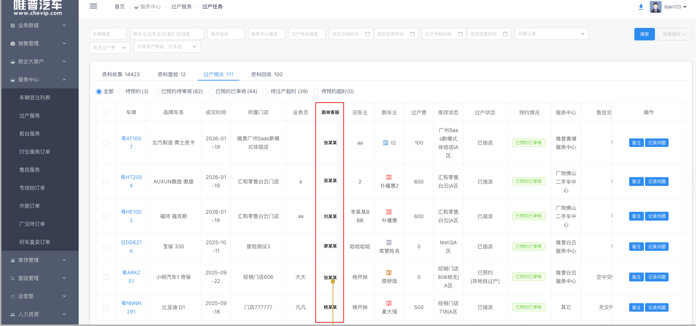

系统：**BMS**

---

# 过户任务 - 跟单客服

## 涉及页面与范围

- **菜单路径**：服务中心 > 过户服务 > 【过户任务】
- **涉及模块**：该页面下的【资料收集】、【资料查验】、【过户相关】、【资料回收】四个 Tab 对应的数据列表

## 1. 数据列表

- 新增"**跟单客服**"列，用于展示该车辆跟单客服名称，位置在"**业务员**"列后面

## 2. 跟单客服分配逻辑

- **2.1** 系统获取该订单归属门店在后台【过户服务】中当前生效的"**跟单客服**"配置名单
- **2.2** 若该门店配置了**多名客服**，随机从中抽取一名客服；抽取完成后，将该客服与该订单**绑定**
  - 逻辑要求：**一旦绑定成功**，该订单前台的二维码展示及列表的客服名称将**永久固定**为此人
- **2.3** 订单一旦在"**付款后**"完成了跟单客服的绑定，即**生成数据快照**；后续对该门店的跟单客服进行了任何修改（如：新增人员、删除现有人员、清空配置等），**仅对修改操作之后**新产生的付款订单生效
- **2.4** 已经完成分配的**历史订单**，其绑定的跟单客服保持原样，**不受后续后台配置变动的影响**

原型：

